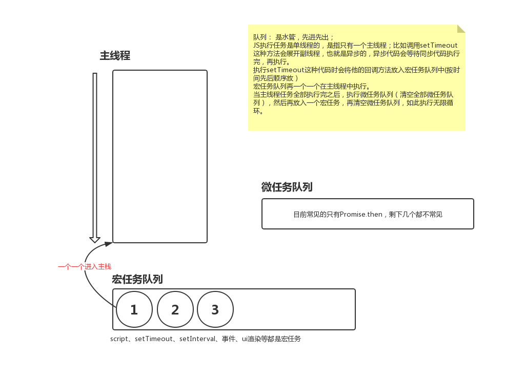

1. **`promise.finally` 的实现**

```javascript
Promise.prototype.finally = function(callback) {
  return this.then(
    val => {
      // 等待finally中的函数执行完毕，继续执行，finally函数可能返还一个promise用Promise.resolve等待返回的promise执行完
      return Promise.resolve(callback().then(() => val));
    },
    err => {
      return Promise.resolve(
        callback().then(() => {
          throw err;
        })
      );
    }
  );
};
Promise.reject()
  .finally(() => {
    console.log(1);
    return new Promise((resolve, reject) => {
      setTimeout(() => {
        resolve();
      }, 1000);
    });
  })
  .catch(e => {
    console.log(e);
  });
```

2. **`Promise.try` 这个方法原生里没有**

**既能捕获同步异常也能捕获异步异常**

```javascript
// 写一个方法 一个方法里能会throw err的同步异常，也可能是返回promise的异步异常，同步的可以用try-catch捕获，promise的要用then/catch捕获，但是我们不确定这个函数是同步错误还是异步错误，所以需要，Promise.try这个方法。下面你是实现方式
function fn() {
  // throw new Error('同步的错误')
  return new Promise((resolve, reject) => {
    setTimeout(() => {
      reject("异步的错误");
    }, 3000);
  });
}
Promise.try = function(callback) {
  return new Promise((resolve, reject) => {
    // Promise.resolve只能返回一个成功的promise所以外面需要再包一层promise
    return Promise.resolve(callback()).then((resolve, reject));
  });
};
Promise.try(fn).catch(err => {
  console.log(err);
});
```

3. **`Promise.race`的实现 谁快用谁**

```javascript
let p1 = new Promise((resolve, reject) => {
  setTimeout(() => {
    resolve("p1");
  }, 1000);
});
let p2 = new Promise((resolve, reject) => {
  setTimeout(() => {
    resolve("p2");
  }, 2000);
});

Promise.race = function(promises) {
  return new Promise((resolve, reject) => {
    for (let i = 0; i < promises.length; i++) {
      promises[i].then((resolve, reject));
    }
  });
};
Promise.race([p1, p2]).then(data => {
  console.log(data);
});
```

4. **`Promise`有哪些优缺点？**

优点： 1.可以解决异步并发问题 Promise.all 2.链式调用
缺点： 1.还是基于回调函数 2. `promise` 无法终止 只能抛弃这次结果

5. **如何终止一个 `promise` 链**

返回一个等待的 promise

```javascript
let p = new Promise((resolve, reject) => {
  resolve();
});
let p1 = p
  .then(() => {
    console.log("ok");
    return new Promise(() => {});
  })
  .then(() => {
    console.log(111);
  });
```

6. **如何放弃某个 `promise` 执行结果**

```javascript
function wrap(p1){
  let fail = null;
  let p2 = new Promise((resolve,reject)=>{
    fail = reject // 先将p2的失败方法暴露出来
  })
  let p = Promise.race([p2,p1]); // race方法返回的也是一个promise
  p.abort = fail;
  return p
}
let p = wrap(new Promise((resolve,reject)=>{
  setTimeout(()=>{
    resolve('啥都行 反正放弃这个结果了')
  },3000)
})
p.abort('调用abort放弃结果')
p.then(data=>{
  console.log(data)
}).catch(err=>{console.log(err)})
```

7. **怎么用 `es5` 来模拟 `es6` 中的 `class`**
8. **`new`的原理**

要想用代码还原 `new` 首先我们应该要先知道 `new` 都做了什么？

- 创建一个对象并返回
- 将构造函数中的 `this` 指向这个对象
- 继承构造函数原型上的方法

**需要注意的是如果构造函数返回的是个引用空间，那么 new 返回的对象就指向这个引用空间**

下面就是实现的代码例子~ 基本可以跟 `new` 的功能一致

```javascript
function Person(name, age) {
  this.name = name;
  this.age = age;
  return null;
}
function _new(...constructor) {
  let [o, ...args] = constructor;
  let obj = {};
  let returnValue = o.call(obj, ...args);
  if (
    (typeof returnValue === "object" || typeof returnValue === "function") &&
    returnValue !== null
  ) {
    return returnValue;
  }
  obj.__proto__ = o.prototype; // 这块也可以用Object.create来做 反正归根到底原理都是这个~
  return obj;
}

let person = _new(Person, "Mopecat", "永远18岁");
let person1 = new Person("Mopecat", "永远18岁");
console.log(person);
console.log(person1);
```

9. **与数组`reduce`相关的面试题**

（1）用`reduce`实现数组扁平化 (flat)

（2）函数的组合 compose

（3）实现 Array.prototype.reduce

代码[这里][1]

10. **模板引擎的实现原理**

直接看代码[这里][2]

11. **浏览器事件环**



[代码及分析][3]

[1]: ./reduce.js
[2]: ./templateEngine.js
[3]: ./eventLoop.js
