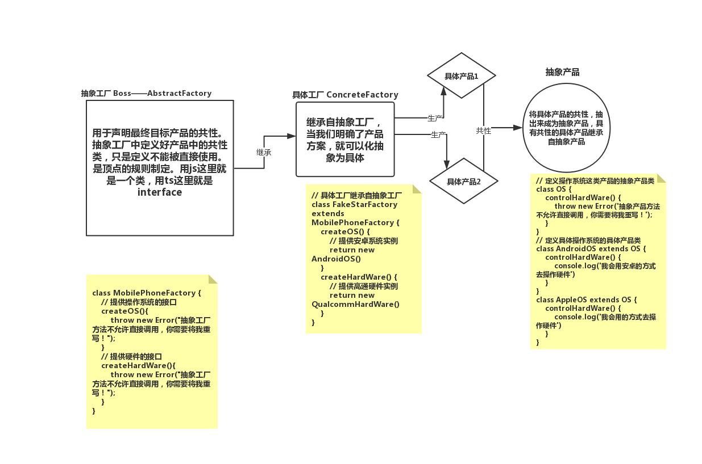

## 简单的工厂模式

工厂模式其实就是**将创建对象的过程单独封装**

总结一下：工厂模式的目的，就是为了实现**无脑传参**，就是为了爽！

文中举例：
是一个员工录入系统，其中共性的部分是 每个员工都有姓名、年龄、身份所以就可以给他们都封装成一个类

```javascript
function User(name, age, career) {
  this.name = name;
  this.age = age;
  this.career = career;
}
```

但是呢，老板说这个系统录入的信息也太简单了，程序员和产品经理之间的区别一个简单的 `career` 字段怎么能说得清？我要求这个系统具备给不同工种分配职责说明的功能。也就是说，要给每个工种的用户加上一个个性化的字段，来描述他们的工作内容。

所以员工的共性被拆离了，想要实现的话，可能就要封装出多个类，比如

```javascript
function Coder(name, age) {
  this.name = name;
  this.age = age;
  this.career = "coder";
  this.work = ["写代码", "写系分", "修Bug"];
}
function ProductManager(name, age) {
  this.name = name;
  this.age = age;
  this.career = "product manager";
  this.work = ["订会议室", "写PRD", "催更"];
}
```

这样公司有多少个工种就会有多少类，所以这样明显是不可以的。回头想一下，所谓的`work`其实也是每个员工都有的共性，只不过 `work` 字段需要随 `career` 字段取值的不同而改变，所以我们改造一下 `User` 类，然后把这个承载了共性的 `User` 类和个性化的逻辑判断写入同一个函数

```javascript
function User(name , age, career, work) {
    this.name = name
    this.age = age
    this.career = career
    this.work = work
}

function Factory(name, age, career) {
    let work
    switch(career) {
        case 'coder':
            work =  ['写代码','写系分', '修Bug']
            break
        case 'product manager':
            work = ['订会议室', '写PRD', '催更']
            break
        case 'boss':
            work = ['喝茶', '看报', '见客户']
        case 'xxx':
            // 其它工种的职责分配
            ...

    return new User(name, age, career, work)
}
```

简单工厂解决的是多个类的问题。那么当复杂度从多个类共存上升到多个工厂共存时又该怎么处理呢？

## 抽象工厂



以上的方式封装
想要生产一台 FakeStar 手机时只需要这样做：

```javascript
// 这是我的手机
const myPhone = new FakeStarFactory();
// 让它拥有操作系统
const myOS = myPhone.createOS();
// 让它拥有硬件
const myHardWare = myPhone.createHardWare();
// 启动操作系统(输出‘我会用安卓的方式去操作硬件’)
myOS.controlHardWare();
// 唤醒硬件(输出‘我会用高通的方式去运转’)
myHardWare.operateByOrder();
```

假如有一天，FakeStar 过气了，我们需要产出一款新机投入市场，这时候怎么办？我们是不是不需要对抽象工厂 `MobilePhoneFactory` 做任何修改，只需要拓展它的种类:

```javascript
class newStarFactory extends MobilePhoneFactory {
  createOS() {
    // 操作系统实现代码
  }
  createHardWare() {
    // 硬件实现代码
  }
}
```

这样一来，对原有的系统不会造成任何潜在影响 所谓的“对拓展开放，对修改封闭”就这么圆满实现了。前面我们之所以要实现抽象产品类，也是同样的道理。

## 总结：

抽象工厂和简单工厂的异同

- 共同点：在于都尝试去分离一个系统中变与不变的部分
- 不同点：场景的复杂度。 简单工厂模式，处理的对象是类，共性容易抽离，逻辑本身比较简单。
  抽象工厂本质上处理的其实也是类，但是是一帮非常棘手、繁杂的类这些类中不仅能划分出门派，
  还能划分出等级，同时存在着千变万化的扩展可能性——这使得我们必须对共性作更特别的处理、使用抽象类去降低扩展的成本，同时需要对类的性质作划分。
  于是有了这样的四个关键角色：

1. **抽象工厂 (抽象类，它不能用于生成具体事例)**: 用于声明最终目标产品的共性。在一个系统里，抽象工厂可以有多个（大家可以想象我们的手机厂后来被一个更大的厂收购了，这个厂里除了手机抽象类，还有平板、游戏机抽象类等等），每一个抽象工厂对应的这一类的产品，被称为“产品族”。

2. **具体工厂 (用于生成产品族里的一个具体的产品)**: 继承自抽象工厂、实现了抽象工厂里声明的那些方法，用于创建具体的产品的类。

3. **抽象产品（抽象类，它不能被用于生成具体实例）**: 上面我们看到，具体工厂里实现的接口，会依赖一些类，这些类对应到各种各样的具体的细粒度产品（比如操作系统、硬件等），这些具体产品类的共性各自抽离，便对应到了各自的抽象产品类。

4. **具体产品（用于生成产品族里的一个具体的产品所依赖的更细粒度的产品）**: 比如我们上文中具体的一种操作系统、或具体的一种硬件等。
