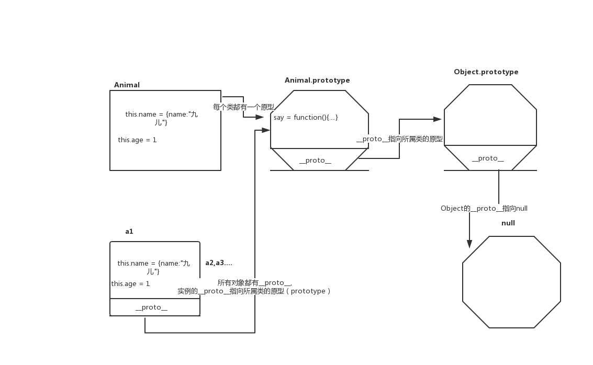

# ES6+

## let const

用 `let` 声明的变量会绑定到当前作用域，用 `let` 声明变量可以保证代码命名不重复。

`const`声明的变量不能更改(对象等不能改变类型，可以改变对象属性)

`import`可以变量提升

**一般我们尽可能用`const`，如果这个值需要改变，我们再使用`let`,`let`和`const`声明的值不会被放到全局上**

## 箭头函数

特点： 箭头函数中没有 `this`, `arguments`, `prototype`。没有就向上找~

## 解构赋值

展开运算符 `...` 常用于合并数组或对象

剩余运算符 `...` （要放在最后面）

**解构的方式都是根据 key 来实现的** (这句是重点)

对象的话修改 key 对应的变量名称用 `:` （这个东西叫冒号） 如果没有对应的属性可以直接设置默认值

代码示例：

<<< @/docs/chapter3/ES6+/解构赋值.js

## set 和 map

`set` 和 `map`是`es6`中的新的数据类型

上面都有一下增删改查清空的方法，区别的话 `set`是`add`, `map`是`set`、`get` 还有对应`Object`的差不多功能方法 `set.keys()`、`set.values()` 、`set.entries()`

特点: **不能放重复项** (数组去重什么的简直不要太方便)

对应的还有弱保持类型 `WeakSet` 和 `WeakMap`

`WeakSet`: 对象是一些对象值的集合, 并且其中的每个对象值都只能出现一次. 与 set 的区别主要有一下两点

- `WeakSet` 对象中只能存放对象引用, 不能存放值, 而 `Set` 对象都可以.
- `WeakSet` 对象中存储的对象值都是被弱引用的, 如果没有其他的变量或属性引用这个对象值, 则这个对象值会被当成垃圾回收掉. 正因为这样, `WeakSet` 对象是无法被枚举的, 没有办法拿到它包含的所有元素.

`WeakMap`: 原生的 `WeakMap` 持有的是每个键或值对象的“弱引用”，这意味着在没有其他引用存在时垃圾回收能正确进行, `WeakMap` 的 `key` 也是不可枚举的

代码示例： 

<<< @/docs/chapter3/ES6+/set+map.js

## class

`es5` 中没有类，用构造函数模拟类。`es5` 中的类可以当做函数来调用，`es6` 中不行



`ES5`中的原型链：

<<< @/docs/chapter3/ES6+/原型链(es5).js


`class`应用代码示例：

<<< @/examples/ES6+/webpack-class/src/class.js

## 装饰器

- 装饰模式：不改变原有状态，在访问原来函数之前做一系列操作
- AOP 面向切片编程
- 重写原型方法 例子，vue 里调用数组方法实现视图的更新 函数劫持，下面例子

```javascript
let oldProto = Array.prototype; // 保留数组原有的原型
let proto = Object.create(oldProto); // 创建了一个新proto
["push", "unshift", "shift"].forEach(method => {
  proto[method] = function(...args) {
    update();
    oldProto[method].call(this, ...args);
  };
});

function observer(obj) {
  // 只将我们传入的数组中的方法重写
  if (Array.isArray(obj)) {
    obj.__proto__ = proto;
  }
}
observer(arr);
arr.push(1);
console.log(arr);
[].push(4, 5, 6);
```

其他代码示例：

<<< @/examples/ES6+/webpack-class/src/index.js

## generator

生成器 生成迭代器的 （**很快就被 async+await 取代掉了，但是相对来讲更加灵活**）

应用实例: `redux-saga`

用法：生成器函数上加 `*` 函数中 关键字 `yield`可以暂停执行，返回值是迭代器 `iterator`可以通过 `iterator.next()`返回对象及当前执行状态类似于这种`{value: 11, done: false}`

代码示例：

<<< @/docs/chapter3/ES6+/generator.js

## Symbol
5中基本的数据类型： `string,boolean,null,number,undefined`

`Symbol`是新增的一种数据类型，独一无二，一旦声明完跟别的值都不相等，所以一般用作声明常量

### 基础用法
```js
const s1 = Symbol("mopecat"); // 接收参数是string || number
const s2 = Symbol("mopecat"); // 接收参数是string || number
console.log(s1 === s2); // false
```

另一种创建方式 `Symbol.for()` 如果没有就创建新的 如果有就返回
```js
let sf1 = Symbol.for("sf");
let sf2 = Symbol.for("sf");
console.log(sf1 === sf2); // true
console.log(Symbol.keyFor(sf1)); // 返回key值 上面的sf
```
在对象中定义 `Symbol` 属性 可以用来做属性私有化
```js

let obj = {
  [s1]: "Symbol定义的值" // es6的写法 []的含义是将s1结果取出来作为key
};
console.log(obj[s1]); // 缺陷是不能用obj.s1来取Symbol的值了
```

### 元编程

可以改变js原有的功能

#### 1) `instanceof` 可以判断谁是谁的实例
```js
let o = {
  name: 1
};
let obj1 = {
  // 下面在使用instanceof时会默认调用下面的这个方法 但是定义了Symbol.hasInstance的对象要在instanceof的右侧
  [Symbol.hasInstance]() {
    return "name" in o;
  }
};
console.log(o instanceof obj1); // true
```
####  2) `Symbol.toPrimitive` 当转换原始类型的时候会调此方法
```js
let obj2 = {
  // 当转换原始类型的时候会调此方法
  [Symbol.toPrimitive](value) {
    console.log(value);
    return "hello";
  },
  a: 1
};
// valueOf toString
console.log(obj2 + 1);
```
####  3）修改衍生对象的类的构造函数
```js
class MyArray extends Array {
  constructor(...args) {
    super(...args); // 继承父类
  }
  // 静态 属性上的方法
  static get [Symbol.species]() {
    return Array; // 控制衍生出来的对象的类的构造函数是Array 不是 MyArray
  }
}
let myarr = new MyArray(1, 2, 3);
let newArr = myarr.map(item => item * 2); // newArr就是衍生出来的数组对象
console.log(newArr instanceof MyArray); // false
```
#### 4) `Symbol.split` 可以重写数组的分割方法
#### 5) `Symbol.search` 可以重写数组的搜索方法
#### 6）`Symbol.match` 可以重写字符串的match方法
#### 7）`Symbol.unscopables()` 可以声明一下属性 不在with中使用
```js
console.log(Array.prototype[Symbol.unscopables]); // 数组上不能用在with中的方法
with (Array.prototype) {
  fill(112); // fill不能用在with中所以报错
}
```
#### 8) `concat`不展开数组 isConcatSpreadable
```js
let arr = [1, 2, 3];
arr[Symbol.isConcatSpreadable] = false;
console.log(arr.concat(4, 5, 6)); // [[1,2,3],4,5,6]
```
#### 例子：
```js
// 再来一个例子
class Me {
  showName() {
    console.log("Mopecat");
  }
  get [Symbol.unscopables]() {
    return { showName: true };
  }
}
with (Me.prototype) {
  showName(); // 报错 如果注掉class Me里的Symbol.unscopables就不会报错了 就会正常打印Mopecat了
}
```
## proxy

`proxy` 兼容性差，代理，可以创建一个代理帮我们干某些事

#### 用法：
```js
let obj = {
  a: 1,
  b: 2
};
let proxy = new Proxy(obj, {
  // 只能代理当前的对象obj 也就是一层
  get(target, key) {
    // return target[key];
    return Reflect.get(target, key); // 跟上一行等价
  },
  set(target, key, value) {
    console.log("更新视图", target, key, value);
    // target[key] = value;
    return Reflect.set(target, key, value); // 跟上一行等价
  }
});
proxy.c = 3;

console.log(obj);
```

#### 如果是多层对象呢 该怎样实现代理呢 看下面的代码~
```js
let obj1 = {
  a: { a: 122 },
  b: 2
};
let handler = {
  get(target, key) {
    if (typeof target[key] === "object" && target[key] !== null) {
      return new Proxy(target[key], handler);
    }
    return Reflect.get(target, key);
  },
  set(target, key, value) {
    console.log("更新");
    return Reflect.set(target, key, value);
  }
};
let proxy1 = new Proxy(obj1, handler);
proxy1.a.a = 1000;
console.log(obj1);
```
#### 数组一样可以实现代理监控

```js
let arr = [1, 2, 3, 4];
let proxyArr = new Proxy(arr, {
  get(target, key) {
    return Reflect.get(target, key);
  },
  set(target, key, value) {
    if (key === "length") return true; // 如果操作会更改数组的length 比如push等 会触发两次set 一次更改 对应的key，一次修改length，所以屏蔽修改length触发的set
    console.log("更新");
    return Reflect.set(target, key, value);
  }
});
proxyArr.push(100);
console.log(arr);
```

## Reflect 反射

有部分是对象的方法，放到了 `Reflect` 上，功能是基本一致的，但是用起来更加的方便

### 1) `get/set`
```js
let obj = {};
obj.name = "Mopecat";
// Reflect用法
Reflect.set(obj, "age", "forever18"); // 参数分别为 target(目标对象) key(属性名) value(值)
```
### 2) `has`
```js
console.log("a" in { a: 1 });
console.log(Reflect.has({ a: 1 }, "a")); // 参数分别为 target(目标对象) key(属性名)
```
### 3) `defineProperty` 用法和功能与`Object.defineProperty`基本一致
```js
const obj3 = { a: 1 };
Object.freeze(obj3); // 这个对象就被冻结了 对象里的属性就不能配置了 如果用Object.defineProperty 配置就会报错了 但是用Reflect.defineProperty就不会 但是如果配置失败会返回false
let flag = Reflect.defineProperty(obj3, "a", {
  value: 100
});
console.log(flag); // false
```
### 4) `getOwnPropertyDescriptor` 获取对象自有属性对应的属性描述 与 `Object.getOwnPropertyDescriptor` 一样
```js
const obj4 = { a: 1 };
console.log(Reflect.getOwnPropertyDescriptor(obj4, "a"));
```
### 5) `ownKeys =  [...Object.getOwnPropertyNames , ...Object.getOwnPropertySymbols]`

`Object.getOwnPropertyNames` 返回一个由指定对象的所有自身属性的属性名（包括不可枚举属性但不包括`Symbol`值作为名称的属性）组成的数组

`Object.getOwnPropertySymbols` 返回一个给定对象自身的所有 `Symbol` 属性的数组
```js
const obj5 = { a: 1, [Symbol()]: 1 };
Object.getOwnPropertySymbols;
let arr5 = Reflect.ownKeys(obj5);
console.log(arr5);
```
### 6) `getPrototypeOf  / setPrototypeOf` 获取或者设置一个对象的原型  参数是 `target` 目标对象 `prototype` 该对象的新原型（也就是一个对象或者`null`）
```js
const obj6 = { a: 1 };
Reflect.setPrototypeOf(obj6, null);
let obj6R = Reflect.getPrototypeOf(obj6);
console.log(obj6R); // null
```
### 7) 函数的apply方法

```js
// 延伸：经典面试题 bind call apply 的区别 共同点都能改变this的指向
const fn = function(a, b) {
  console.log(this, a, b);
};
// apply 支持多个参数传参
fn.apply(1, [2, 3]); // this:1 , a:2 , b:3
// call 参数要一个一个传 并直接执行函数
fn.call(1, 2, 3);
// bind产生一个新的函数 剩下的参数也要一个一个传（bind函数可以用函数柯里化写出来）
let fn2 = fn.bind(1, 2, 3);

Reflect.apply(fn, 1, [2, 3]); // fn 绑定的函数，1 this的指向，[2,3]是参数 等价于 Function.prototype.apply.call(fn,1,[2,3]) 这样做的是为了 调用原型上的apply方法 （比如在实例上写了一个apply方法 但是你想调用的原型上的 就这样用行了）
```
### 8) `construct` 构造器 跟`new`的功能一样
```js
class Example {
  constructor(name, age) {
    this.name = name;
    this.age = age;
  }
}
let example = Reflect.construct(Example, ["Mopecat", "forever18"]); // 参数  target构造函数 ，[]参数数组
console.log(example);
```
### 10) `isExtensible / preventExtensions`  是否可扩展 / 组织扩展
```js
let obj10 = {};
Reflect.preventExtensions(obj10);
obj10.a = 1;
console.log(obj10, Reflect.isExtensible(obj10));
```

## Object.defineProperty

### 用法：
```js
let obj1 = {};
let val = ""; // 修改的时候一样也要用个第三方变量中转一下
Object.defineProperty(obj1, "a", {
  configurable: true, // 是否可配置（删除）
  // writable: true, // 是否可写 （写了get 和 set 要删除这个属性 默认就是可写的了）
  enumerable: true, // 是否可枚举
  get() {
    return val;
  },
  set(value) {
    console.log(value);
    val = value;
  }
});
console.log(obj1);
```

### vue中的数据劫持 就是给每一个对象都添加一个getter和setter  当值变化了  可以实现更新视图的功能 原理代码~~
```js
let obj3 = {
  a: { a: 1 },
  b: 2
};
// 更新视图方法
let updateView = () => {
  console.log("更新了视图");
};
// 缺陷就是无法监控数组的变化
function observer(obj) {
  if (typeof obj !== "object" || obj == null) {
    return;
  }
  for (let key in obj) {
    // 因为defineProperty需要一个特公共的值去修改，所以利用函数作用域将value保存下来作为公共的值去修改
    defineReactive(obj, key, obj[key]);
  }
}

function defineReactive(obj, key, value) {
  observer(value); // 递归增加getter 和 setter
  Object.defineProperty(obj, key, {
    get() {
      return value;
    },
    set(val) {
      updateView();
      value = val;
    }
  });
}
observer(obj3);
obj3.b = 100;
console.log(obj3.b);
```
因为递归更加消耗性能 且 不能监控数组变化 且 无法增加被监控的属性（需要通过`vm.$set`来实现） 所以新版改用`proxy`来实现


