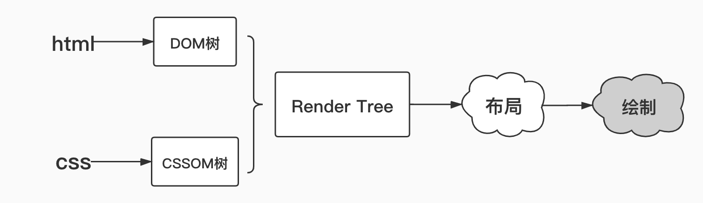

## 图片优化

- `JPEG/JPG`

  关键字: 有损压缩、体积小、加载快、不支持透明

  使用场景: `JPG` 图片经常作为大的背景图、轮播图或 Banner 图出现。

- `PNG-8` 与 `PNG-24`

  关键字：无损压缩、质量高、体积大、支持透明

  使用场景：由于 PNG 在处理线条和颜色对比度方面的优势，我们主要用它来呈现小的 Logo、颜色简单且对比强烈的图片或背景等。

  如何确定一张图片是该用 `PNG-8` 还是 `PNG-24` 去呈现呢？好的做法是把图片先按照这两种格式分别输出，看 PNG-8 输出的结果是否会带来肉眼可见的质量损耗，并且确认这种损耗是否在我们（尤其是你的 UI 设计师）可接受的范围内，基于对比的结果去做判断。

- `SVG`

  关键字：文本文件、体积小、不失真、兼容性好

  使用场景：矢量图

  优势： 我们既可以像写代码一样定义 `SVG`，把它写在 `HTML` 里、成为 `DOM` 的一部分，也可以把对图形的描述写入以 `.svg` 为后缀的独立文件（`SVG` 文件在使用上与普通图片文件无异）。这使得 `SVG` 文件可以被非常多的工具读取和修改，具有较强的灵活性

  缺点： 1. 渲染成本比较高 2. 因为是可编程的，所以有一定的学习成本

- `Base64`

  关键字：文本文件、依赖编码、小图标解决方案

  使用场景：

  - 图片的实际尺寸很小（几乎没有超过 2kb 的）
  - 图片无法以雪碧图的形式与其它小图结合（合成雪碧图仍是主要的减少 HTTP 请求的途径，Base64 是雪碧图的补充）
  - 图片的更新频率非常低（不需我们重复编码和修改文件内容，维护成本较低）

- `WebP`

  关键字：年轻的全能型选手

  优点：无损压缩比`PNG`更小，有损压缩也比`jpg`更小，有损 `WebP` 也支持透明度

  缺点： 兼容性差

  用谷歌浏览器访问淘宝首页搜索`webp`图片是可以找到的。应用方式可以是，前端判断当前浏览器类型 如果是支持`Webp`的情况优先使用`webp`，如果不行的话就将图片降级为`jpg`（切割`url`）

  但是这样并不灵活，如果有一天`webp`大行其道，多数浏览器都支持了，那就需要时常去维护浏览器兼容判断逻辑。麻烦！！所以维护性更强，更加灵活的方案是----把判断工作交给后端，由服务器根据 `HTTP` 请求头部的 `Accept` 字段来决定返回什么格式的图片。当 `Accept` 字段包含 `image/webp` 时，就返回 `WebP` 格式的图片，否则返回原图。
  当然上述还有一个事几乎可以忽略不计哈，就是由于兼容性的原因，同一张图片要准备两份。

  ## HTTP 缓存

  按失效策略分类：

- 强缓存
  强缓存是指客户端在第一次请求后，有效时间内不会再去请求服务器，而是直接使用缓存数据。

  - `Expires` 是一个未来时间的时间戳，表示缓存资源的过期时间，由服务端下发。由于有以下几点缺陷已经被淘汰：

    - 可能会因为服务器和客户端的 GMT 时间不同，出现偏差
    - 如果修改了本地时间，那么客户端端日期可能不准确
    - 写法太复杂，字符串多个空格，少个字母，都会导致非法属性从而设置失效
      `Expires:Tue, 13 May 2020 09:33:34 GMT`

  - `Cache-control` 现在缓存大多数都是用的这个响应头部，功能非常强大。它具有多个不同的值(下面是比较常用的几个)：

    - `private`: 表示私有缓存，不能被共有缓存代理服务器缓存，不能在用户间共享，可被用户的浏览器缓存。
    - `public`: 表示共有缓存，可被代理服务器缓存，比如 CDN，允许多用户间共享
    - `max-age`: 值以秒为单位，表示缓存的内容会在该值后过期（用于替代`Expires`）**HTTP 规定，如果 Cache-control 的 max-age 和 Expires 同时出现，那么 max-age 的优先级更高，他会默认覆盖掉 expires。**
    - `no-cache`: 需要使用协商缓存，协商缓存的内容我们后面介绍。注意这个字段并不表示不使用缓存
    - `no-store`: 所有内容都不会被缓存
    - `must-revalidate`: 告诉浏览器，你这必须再次验证检查信息是否过期, 返回的状态码就不是 `200` 而是 `304` 了

    关于 `Cache-control` 取值总结，我们可以参考 `Google developer` 的一个图示

    

- 协商缓存

  强缓存判断的实质上是缓存资源是否超出某个时间或者某个时间段。很多情况是超出了这个时间或时间段，但是资源并没有更新。从优化的角度来说，我们真正应该关心的是服务器端文件是否已经发生了变化。此时我们需要用到协商缓存策略。

  强缓存关于是否使用缓存的决断完全是由浏览器做出的，但是浏览器**是不可能知道服务器端的文件是否发生了更改的**，所以协商缓存就是将是否启用缓存的决定权交给服务器端，因此协商缓存还是需要一次网络请求的。

  协商缓存过程：在浏览器端，当对某个资源的请求没有命中强缓存时，浏览器就会发一个请求到服务器，验证协商缓存是否命中，如果协商缓存命中，请求响应返回的 HTTP 状态为 304。

  根据 `HTTP` 协议，这个决断是根据【Last-Modified，If-Modified-Since】和【ETag、If-None-Match】这两对 header 来作出的。

  - Last-Modified，If-Modified-Since 主导的协商缓存过程:

    1. 浏览器第一次请求资源，服务端在返回资源的响应头中加入 `Last-Modified` 字段，这个字段表示这个资源在服务器上的最近修改时间
       `Last-Modified: Tue, 12 Jan 2019 09:08:53 GMT`
    2. 浏览器收到响应，并记录 `Last-Modified` 这个响应头的值为 T
    3. 当浏览器再次向服务端请求该资源时，请求头加上 `If-Modified-Since` 的 header，这个 `If-Modified-Since` 的值正是上一次请求该资源时，后端返回的 `Last-Modified` 响应头值 T
    4. 服务端再次收到请求，根据请求头 `If-Modified-Since` 的值 T，判断相关资源是否在 T 时间后有变化；如果没有变化则返回 `304 Not Modified`，且并不返回资源内容，浏览器使用资源缓存值；如果有变化，则正常返回资源内容，且更新 `Last-Modified` 响应头内容

  这种基于时间的判断方式跟`Expires`的问题有些相似，1. 如果客户端时间不准确，判断就不可靠。 2. `Last-Modified`只能精确到秒级，如果某些文件 1 秒内呗修改多次，就不能准确地标注修改时间 3.一些文件会周期性修改，但是内容并不改变，仅仅改变的是修改时间，这时候用 `Last-Modified`就不是很合适了。为了弥补这些缺陷就有了，【ETag、If-None-Match】这一对 header 头来进行协商缓存的判断。

  - ETag、If-None-Match 主导的协商缓存过程:

    1. 浏览器第一次请求资源，服务端在返回资源的响应头中加入 `Etag`，`Etag` 能够弥补 `Last-Modified` 的问题，因为 `Etag` 的生成过程类似文件 `hash` 值，`Etag` 是一个字符串，不同文件内容对应不同的 `Etag` 值

    ```
    //response Headers
    ETag: "751F63A30AB5F98F855D1D90D217B356"
    ```

    2. 浏览器收到响应，记录 `Etag` 这个响应头的值为 E
    3. 浏览器再次跟服务器请求这个资源时，在请求头上加上 `If-None-Match`，值为 `Etag` 这个响应头的值 E
    4. 服务端再次收到请求，根据请求头 `If-None-Match` 的值 E，根据资源生成一个新的 `ETag`，对比 E 和新的 `Etag`：如果两值相同，则说明资源没有变化，返回 `304 Not Modified`，同时携带着新的 `ETag` 响应头；如果两值不同，就正常返回资源内容，这时也更新 `ETag` 响应头
    5. 浏览器收到 304 的响应后，就会从缓存中加载资源

    `Etag` 优先级比 `Last-Modified` 高，如果他们组合出现在请求头当中，我们会优先采用 `Etag` 策略

    同时 `Etag` 也有自己的问题：相同的资源，在两台服务器产生的 `Etag` 是不是相同的，所以对于使用服务器集群来处理请求的网站来说， `Etag` 的匹配概率会大幅降低。(负载均衡的情况)

由上述内容我们看出：为了使缓存策略更加可靠，灵活，HTTP 1.0 版本 和 HTTP 1.1 版本的缓存策略一直是在渐进增强的。这也意味着 HTTP 1.0 版本 和 HTTP 1.1 版本关于缓存的特性可以同时使用，强制缓存和协商缓存也会同时使用。当然他们在混合使用时有优先级的限制，我们通过下面这个流程图来做一个总结：


按缓存位置分类：

- memory cache // 内存
- disk cache // 磁盘
- Service Worker

## css 优化

**注意**：

- CSS 引擎查找样式表，对每条规则都按从右到左的顺序去匹配。

  错误的情况

  ```css
  #myList li {
  }
  ```

  由于从右向左进行匹配，所以最先匹配`li`这时会将所有的`Dom`中的所有`li`元素，并且每次匹配到了都要去确认`li`元素的父元素的 `id` 是否是`myList`，显然这样的性能是很不好的

  对于这种情况的修改是：

  ```css
  .myList_li {
  }
  ```

  通过上面的分析，可以总结出以下性能提升的方案：

  - 避免使用通配符，只对需要用到的元素进行选择。
  - 关注可以通过继承实现的属性，避免重复匹配重复定义。
  - 少用标签选择器
  - 不要画蛇添足，`id` 和 `class` 选择器不应该被多余的标签选择器拖后腿。
    ```css
    /* 错误 */
    .myList#title
    /* 正确 */
    #title
    ```
  - 减少嵌套。后代选择器的开销是最高的，因此我们应该尽量将选择器的深度降到最低（最高不要超过三层），尽可能使用类来关联每一个标签元素。

## 加载顺序优化



- DOM 树：解析 HTML 以创建的是 DOM 树（DOM tree ）：渲染引擎开始解析 HTML 文档，转换树中的标签到 DOM 节点，它被称为“内容树”。
- CSSOM 树：解析 CSS（包括外部 CSS 文件和样式元素）创建的是 CSSOM 树。CSSOM 的解析过程与 DOM 的解析过程是并行的。
- 渲染树：CSSOM 与 DOM 结合，之后我们得到的就是渲染树（Render tree ）。
- 布局渲染树：从根节点递归调用，计算每一个元素的大小、位置等，给每个节点所应该出现在屏幕上的精确坐标，我们便得到了基于渲染树的布局渲染树（Layout of the render tree）。
- 绘制渲染树: 遍历渲染树，每个节点将使用 UI 后端层来绘制。整个过程叫做绘制渲染树（Painting the render tree）。

由上面过程可知，需要将 DOM 和 CSSOM 两个合并成渲染树，也就是说哪一个没加载完都不能渲染任何内容，所以 css 文件应该尽早的下载，以防止阻塞渲染，所以 css 放在 head 标签里并且使用 cdn 两项十分有必要

js 引擎是独立于渲染引擎的，也就是说 script 标签的代码在何处插入就在何处执行 js,当 html 解析器遇到一个 script 标签的时候他就会暂停渲染。由 js 引擎执行 js，所以一般来说会将 script 标签放在 html 文档的最后面。
除此之外 script 标签还有两种加载方式：`async/defer`

```html
<script async src="index.js"></script>
```

async 模式下，JS 不会阻塞浏览器做任何其它的事情。它的加载是异步的，当它加载结束，JS 脚本会立即执行。

```html
<script defer src="index.js"></script>
```

`defer` 模式下，JS 的加载是异步的，执行是被推迟的。等整个文档解析完成、`DOMContentLoaded` 事件即将被触发时，被标记了 `defer` 的 JS 文件才会开始依次执行。

从应用的角度来说，一般当我们的脚本与 DOM 元素和其它脚本之间的依赖关系不强时，我们会选用 async；当脚本依赖于 DOM 元素和其它脚本的执行结果时，我们会选用 defer。

通过审时度势地向 script 标签添加 `async/defer`，我们就可以告诉浏览器在等待脚本可用期间不阻止其它的工作，这样可以显著提升性能。

## Dom 性能优化

减少 DOM 操作，可以使用 DOM Fragment

## 回流与重绘

- 回流： 当我们对 DOM 的修改引发了 DOM 几何尺寸的变化（比如修改元素的宽、高或隐藏元素等）时，浏览器需要重新计算元素的几何属性（其他元素的几何属性和位置也会因此受到影响），然后再将计算的结果绘制出来。这个过程就是回流（也叫重排）。
- 重绘： 当我们对 DOM 的修改导致了样式的变化、却并未影响其几何属性（比如修改了颜色或背景色）时，浏览器不需重新计算元素的几何属性、直接为该元素绘制新的样式（跳过了上图所示的回流环节）。这个过程叫做重绘。

重绘不一定导致回流，回流一定会导致重绘

## 懒加载

简单的原理代码，还有可优化的地方，比如节流和防抖，比如如果图片都加载完了，还要卸载事件等等

<<< @/docs/chapter6/lazy-load/index.html

## 节流和防抖

频繁触发回调导致的大量计算会引发页面的抖动甚至卡顿。为了规避这种情况，我们需要一些手段来控制事件被触发的频率。就是在这样的背景下，`throttle`（事件节流）和 `debounce`（事件防抖）出现了。

**节流和防抖的本质：**

**这两个东西都以闭包的形式存在。**

**它们通过对事件对应的回调函数进行包裹、以自由变量的形式缓存时间信息，最后用 setTimeout 来控制事件的触发频率。**

- 事件节流（`Throttle`）:
  `throttle` 的中心思想在于：在某段时间内，不管你触发了多少次回调，我都只认第一次，并在计时结束时给予响应。

  ```javascript
  // fn是我们需要包装的事件回调, interval是时间间隔的阈值
  function throttle(fn, interval) {
    // last为上一次触发回调的时间
    let last = 0;

    // 将throttle处理结果当作函数返回
    return function() {
      // 保留调用时的this上下文
      let context = this;
      // 保留调用时传入的参数
      let args = arguments;
      // 记录本次触发回调的时间
      let now = +new Date();

      // 判断上次触发的时间和本次触发的时间差是否小于时间间隔的阈值
      if (now - last >= interval) {
        // 如果时间间隔大于我们设定的时间间隔阈值，则执行回调
        last = now;
        fn.apply(context, args);
      }
    };
  }
  // 用throttle来包装scroll的回调
  const better_scroll = throttle(() => console.log("触发了滚动事件"), 1000);
  document.addEventListener("scroll", better_scroll);
  ```

- 事件防抖（`Debounce`）

  防抖的中心思想在于：我会等你到底。在某段时间内，不管你触发了多少次回调，我都只认最后一次。 即每触发一次都清空上一个

  ```javascript
  // fn是我们需要包装的事件回调, delay是每次推迟执行的等待时间
  function debounce(fn, delay) {
    // 定时器
    let timer = null;

    // 将debounce处理结果当作函数返回
    return function() {
      // 保留调用时的this上下文
      let context = this;
      // 保留调用时传入的参数
      let args = arguments;

      // 每次事件被触发时，都去清除之前的旧定时器
      if (timer) {
        clearTimeout(timer);
      }
      // 设立新定时器
      timer = setTimeout(function() {
        fn.apply(context, args);
      }, delay);
    };
  }

  // 用debounce来包装scroll的回调
  const better_scroll = debounce(() => console.log("触发了滚动事件"), 1000);

  document.addEventListener("scroll", better_scroll);
  ```

但是防抖是有问题的，如果用户操作的十分频繁，一段时间内都在 delay 时间内进行了下一次操作，那么回调就会一直被清除掉，操作得不到响应，造成了卡死了的假象。这个时候就需要节流和防抖结合一下

中心思想是，delay 时间内，重新生成定时器，但是只要 delay 时间到了就必须给用户一个响应。

结合版本：重点哦

```javascript
// fn是我们需要包装的事件回调, delay是时间间隔的阈值
function throttle(fn, delay) {
  // last为上一次触发回调的时间, timer是定时器
  let last = 0,
    timer = null;
  // 将throttle处理结果当作函数返回

  return function() {
    // 保留调用时的this上下文
    let context = this;
    // 保留调用时传入的参数
    let args = arguments;
    // 记录本次触发回调的时间
    let now = +new Date();

    // 判断上次触发的时间和本次触发的时间差是否小于时间间隔的阈值
    if (now - last < delay) {
      // 如果时间间隔小于我们设定的时间间隔阈值，则为本次触发操作设立一个新的定时器
      clearTimeout(timer);
      timer = setTimeout(function() {
        last = now;
        fn.apply(context, args);
      }, delay);
    } else {
      // 如果时间间隔超出了我们设定的时间间隔阈值，那就不等了，无论如何要反馈给用户一次响应
      last = now;
      fn.apply(context, args);
    }
  };
}

// 用新的throttle包装scroll的回调
const better_scroll = throttle(() => console.log("触发了滚动事件"), 1000);

document.addEventListener("scroll", better_scroll);
```
