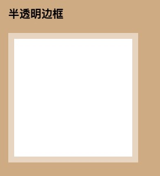
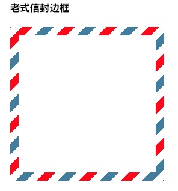

# 背景与边框

## 半透明边框

默认情况下，背景会延伸到边框区域的下层，所以当有背景颜色且边框是透明的时候，背景颜色会透出来。可以通过下面的例子简单看出来效果（后续的代码会只写关键部分 省略掉宽高）

```css
.dashed {
  width: 200px;
  height: 200px;
  border: 10px dashed #666;
  background: green;
}
```


解决方案：

从背景与边框第三版开始，我们可以通过`background-clip`属性来调整上述行为所带来的不便。这个属性的默认值是 `border-box`，类似于盒模型，这个属性代表背景以边框为边界被裁剪掉。
当我们不希望背景侵入边框的范围，则可以把值设置为 `padding-box`，下面来用这个属性实现一下半透明边框

```css
border: 10px solid rgba(255, 255, 255, 0.5);
background: white;
background-clip: padding-box;
```

效果图： 为了加强视觉效果我加了浅色的背景颜色



## 老式信封边框

将背景氛围两层 第一层用纯白色背景，`background-clip`采用`padding-box`,第二层用重复的线性渐变就是一个三中颜色的条纹背景，第一层会盖在第二层上面所以看起来就是个边框的样式。而且单位都用的是`em`是会自动适应大小的

```css
.vintag-envelope {
  padding: 1em;
  border: 1em solid transparent;
  background: linear-gradient(white, white) padding-box, repeating-linear-gradient(
        -45deg,
        red 0,
        red 12.5%,
        transparent 0,
        transparent 25%,
        #58a 0,
        #58a 37.5%,
        transparent 0,
        transparent 50%
      ) 0 /5em 5em;
}
```

效果图：


