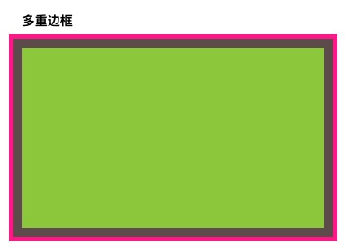
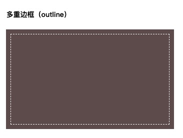

# 背景与边框

本章节所有代码示例地址： [示例](http://feely.fun/examples/css/borderBackground/index.html)

## 半透明边框

默认情况下，背景会延伸到边框区域的下层，所以当有背景颜色且边框是透明的时候，背景颜色会透出来。可以通过下面的例子简单看出来效果（后续的代码会只写关键部分 省略掉宽高）

```css
.dashed {
  width: 200px;
  height: 200px;
  border: 10px dashed #666;
  background: green;
}
```


解决方案：

从背景与边框第三版开始，我们可以通过`background-clip`属性来调整上述行为所带来的不便。这个属性的默认值是 `border-box`，类似于盒模型，这个属性代表背景以边框为边界被裁剪掉。
当我们不希望背景侵入边框的范围，则可以把值设置为 `padding-box`，下面来用这个属性实现一下半透明边框

```css
border: 10px solid rgba(255, 255, 255, 0.5);
background: white;
background-clip: padding-box;
```

效果图： 为了加强视觉效果我加了浅色的背景颜色


## 多重边框

::: tip
前置知识：

```css
box-shadow: 水平偏移量 垂直偏移量 模糊距离 扩张半径 颜色 内/外侧阴影(inset/outset);
```

:::

我们可以用`box-shadow`来模拟一个实线边框，具体做法就是把水平、垂直偏移量赋值为 0，模糊距离为 0，再加上一个正值的扩张半径得到的投影其实就像是一个实线边框。这也没啥可说的，其实用 `boder` 也一样可以实现这样的效果，但是 `box-shadow` 的好处在于我们可以用逗号分隔创建任意数量的投影，所以我们就可以想写多少层就写多少层了。

这里需要注意的是，**阴影是层层叠加的，而第一层位于最顶层，所以我们在计算的时候扩张半径是是层层递加**，如下效果图深粉色边框 5px，但是扩张半径为 15px 要把前面的灰色半径算进去

这种实现方式有两个缺点以及解决方式如下：

- 投影行为和边框完全不一样，它不会影响布局，不占据空间，同时不会受到`box-sizing`影响，不过也可以用内边距或者外边距来额外模拟出来空间。
- 第二点就是模拟出来的边框不会触发鼠标事件，比如 hover 或者点击，如果需要的话可以设置为内侧阴影。

```css
.multiple-border {
  background: yellowgreen;
  box-shadow: 0 0 0 10px #655, 0 0 0 15px deeppink;
}
```

效果图：



另一种实现方式就是采用`outline`，相对于用阴影来实现要更加的灵活，因为阴影只能模拟实线边框。同时我们可以用 `outline-offset` 设置偏移距离，且这个属性支持负值，下面我们简单实现一下缝边的效果。

```css
.multiple-border2 {
  background: #655;
  outline: 1px dashed #ffffff;
  outline-offset: -10px;
}
```



## 老式信封边框

将背景氛围两层 第一层用纯白色背景，`background-clip`采用`padding-box`,第二层用重复的线性渐变就是一个三中颜色的条纹背景，第一层会盖在第二层上面所以看起来就是个边框的样式。而且单位都用的是`em`是会自动适应大小的

```css
.vintag-envelope {
  padding: 1em;
  border: 1em solid transparent;
  background: linear-gradient(white, white) padding-box, repeating-linear-gradient(
        -45deg,
        red 0,
        red 12.5%,
        transparent 0,
        transparent 25%,
        #58a 0,
        #58a 37.5%,
        transparent 0,
        transparent 50%
      ) 0 /5em 5em;
}
```

效果图：


