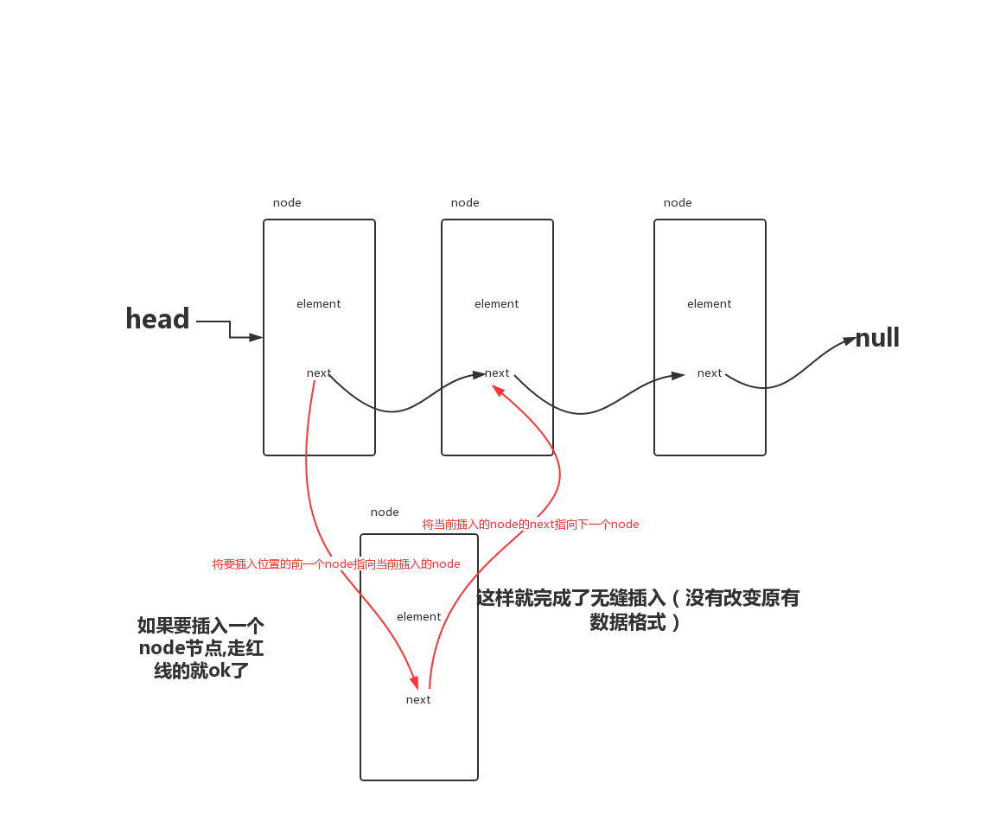

## 数据结构

- 队列： 先进先出（水管） 应用例子，事件环的微任务队列，宏任务队列 [代码][2]

- 栈： 先进后出（瓶子） 例子，代码执行 [代码][2]

- 链表：查找快，删除和添加方便，例子，流 应用的是双向链表 [代码][2]

单向链表

- 集合、hash 表： 取得速度快，扩展不方便 例子，`js`中的`set` `map`类型 [代码][2]

- 树： 二叉树，红黑树等 [代码][1]

二叉树

[1]: ./二叉树.js
[2]: ./数据结构.js
